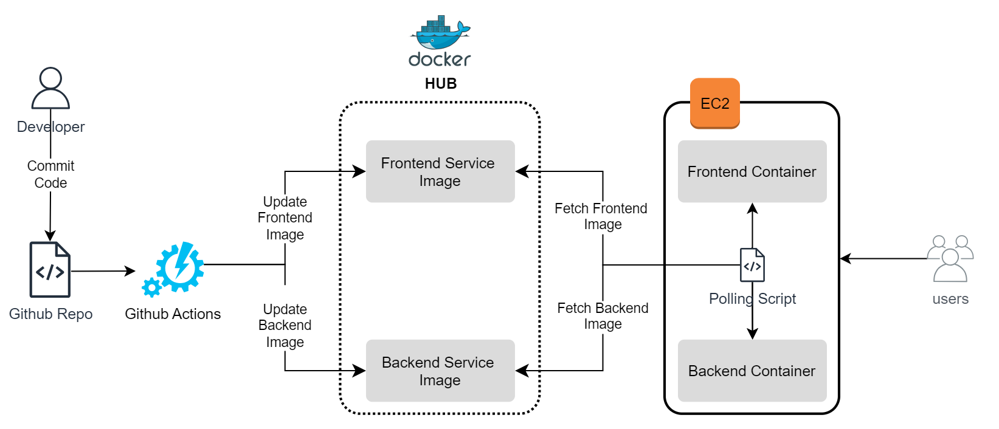

# Basic MLOps pipeline for [Santander Customer Transaction Prediction](https://www.kaggle.com/c/santander-customer-transaction-prediction/overview)


## Objective
This repo aims to demonstarate MLOps skills while solving a classification problem from Kaggle. To know more about Problem Statement, refer [here](https://www.kaggle.com/c/santander-customer-transaction-prediction/overview).


## Public Endpoints for Deployed App
Before diving into code, checkout [frontend](http://3.7.49.154:8080/) and [backend](http://3.7.49.154:8000/) service for prediction available on public endpoint.

<!-- Now, depending on how much time it had been since last changes in this repo, the above endpoints may not be available.  -->
You can deploy it on your own easily and (possibly) free of charge on cloud. Scroll down to `Docker Playground Cloud Deployment` in `Deployment` section.


## Architecture Diagram



## Code Structure / Services
- `notebooks` - Contains EDA (exploratory data analysis) and model development steps including all preprocessing and evaluation. Once preprocessing steps are defined and model is selected, final code is processed to `model_training/train.py` for CI/CD.
- `src` - Contains frontend and backend services along with champion model training script.
    - `backend` - RestAPI endpoints developed using [FastAPI](https://fastapi.tiangolo.com/).
    - `frontend` - Basic frontend app developed using [Streamlit](https://streamlit.io/).
    - `model_training` - Depending on model/data size and model training time, this could be excuted on locally hosted runner.
        - `train_boilerplate` - Boiler plate code for all steps to approach a classification problem.
        - `train` - Final selected model and preprocessing code that are to be executed for train/predict pipeline.
- `docker-compose` - Compose file which starts backend and frontend services to run application.


## Operations side of MLOps / Workflows Description
There are two github workflows each for managing frontend and backend services, described below -
- `frontend_container` - Monitors file changes in `src/frontend/`, any change in `.py` files here will trigger this and it'll rebuild frontend container image for the application and push to dockerhub. More details [here](https://github.com/uditmanav17/assessments/blob/main/.github/workflows/frontend_container.yml).
- `train_model` - Monitors file changes in `src/backend/` and `src/model_training/train.py`, any change here will trigger this workflow and it'll train the model described in `train.py` and pack it up in docker container with backend service for the application and push to dockerhub. More details [here](https://github.com/uditmanav17/assessments/blob/main/.github/workflows/train_model.yml).
- Updating containers on remote server is done via `polling` implemented [here](https://github.com/uditmanav17/assessments/blob/main/check_docker_hashes.py). This script is set up as `CRON` job with time interval of `300s`. It compares local and remote containers hash and deploys updated container in case of mismatch.


## Deployment
- Local deployment
    - Install Docker. Instructions available [here](https://docs.docker.com/engine/install/). Make sure docker is up and running before proceeding.
    - Install Git. Instruction [here](https://git-scm.com/book/en/v2/Getting-Started-Installing-Git).
    - Clone repo and run compose
    ```
    git clone https://github.com/uditmanav17/assessments.git && cd ./assessments
    docker compose --profile app up
    ```
    - `--profile app` will start both frontend and backend services on `localhost:8080` and `localhost:8000` ports.

- Docker Playground Cloud Deployment
    - Navigate to [docker playground](https://labs.play-with-docker.com/).
    - Login using your docker account. Click Start. This will direct you to a new page.
    - Click `Add New Instance` on left pane. Then run following commands in terminal -
    ```
    git clone https://github.com/uditmanav17/assessments.git && cd ./assessments
    docker compose --profile app up
    ```
    - This will open up port `8000` for backend endpoints and `8080` for frontend.
    - To access application, click on port numbers next to `OPEN PORT` button to visit frontend/backend service.


## Future Work / Improvements
- Use event driven approach instead of polling for deployment.
- Data validation checks on uploaded files.
- Data versioning - [DVC](https://dvc.org/)
- Experiment and artifacts tracking - [MLFlow](https://mlflow.org/), [WandB](https://wandb.ai/site)
- Better methods to save and load models like joblib, [don't pickle](https://news.ycombinator.com/item?id=32431036).
- Serverless on-demand architecture.
- Run backend server with `gunicorn` instead of `uvicorn`.
- More tips [here](https://www.ravirajag.dev/blog).
- If using deep learning model, try [quantization](https://deci.ai/quantization-and-quantization-aware-training/) and converting model to [ONNX](https://onnx.ai/) format for better inference speed and less memory usage.
